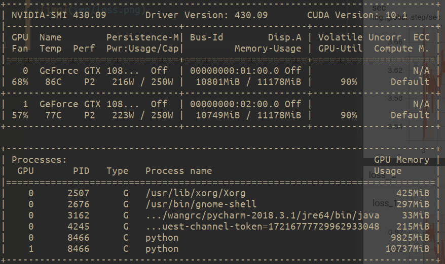
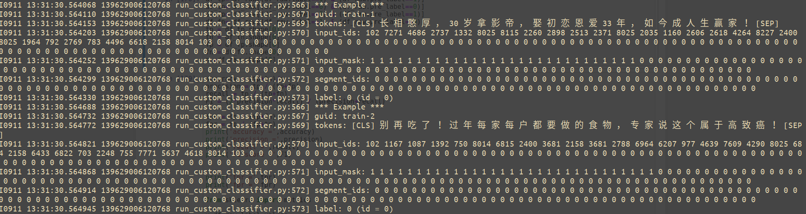
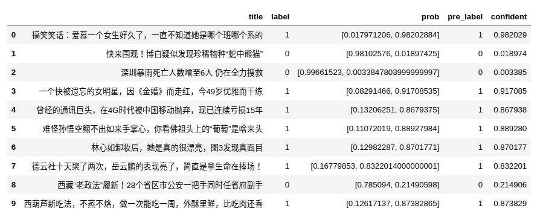
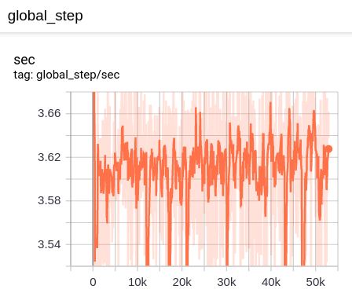
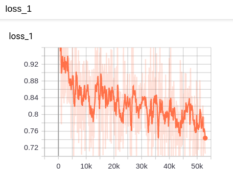
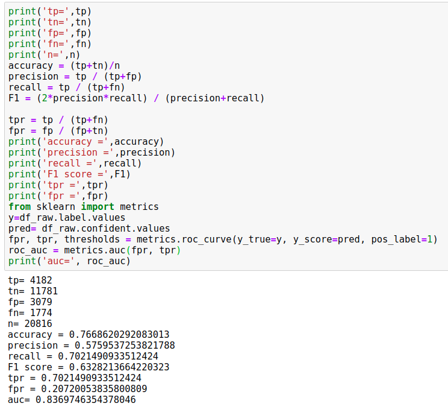
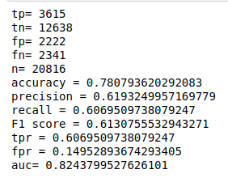

# bert_multi_gpu

### Transformer考上了北京大学；CNN进了中等技术学校；RNN在百货公司当售货员：我们都有光明的前途。

## 基本介绍

Base bert模型采用的是[中文预训练BERT-wwm-ext](https://github.com/ymcui/Chinese-BERT-wwm)。与bert或者bert-wwm的主要区别在于使用了extended data，并在数据集上迭代了更多步（100k -> 1M）。

我的下游任务为文本点击率分级。输入为文章标题，希望能找到其与点击率CTR的关系。个人认为需要模型能够理解语义，判断出究竟哪些标题更吸引人，而不是像word2vec，lda等其他算法学到统计学的特征。


### 模型基线：简体中文阅读理解：CMRC 2018
[**CMRC 2018数据集**](https://github.com/ymcui/cmrc2018)是哈工大讯飞联合实验室发布的中文机器阅读理解数据。
根据给定问题，系统需要从篇章中抽取出片段作为答案，形式与SQuAD相同。

| 模型 | 开发集 | 测试集 | 挑战集 |
| :------- | :---------: | :---------: | :---------: |
| BERT | 65.5 (64.4) / 84.5 (84.0) | 70.0 (68.7) / 87.0 (86.3) | 18.6 (17.0) / 43.3 (41.3) | 
| ERNIE | 65.4 (64.3) / 84.7 (84.2) | 69.4 (68.2) / 86.6 (86.1) | 19.6 (17.0) / 44.3 (42.8) | 
| **BERT-wwm** | 66.3 (65.0) / 85.6 (84.7) | 70.5 (69.1) / 87.4 (86.7) | 21.0 (19.3) / 47.0 (43.9) | 
| **BERT-wwm-ext** | 67.1 (65.6) / 85.7 (85.0) | 71.4 (70.0) / 87.7 (87.0) | 24.0 (20.0) / 47.3 (44.6) |
| **RoBERTa-wwm-ext** | **67.4 (66.5) / 87.2 (86.5)** | **72.6 (71.4) / 89.4 (88.8)** | **26.2 (24.6) / 51.0 (49.1)** |

## 用两块1080ti做的bert fine tune

gpu性能基本都是跑满的。一块1080ti大概每秒可以训练60个case。两块可以提升到每秒110个case左右。(batch size = 32)




## bert样本数据


## 模型结果评估
结果表：


训练了大概5个小时。可以看出模型还是在缓慢收敛的。

 

### eval的结果

模型指标，顺便把各种指标的定义也截图在这里，温故而知新。


ROC曲线


## 主要代码修改

主要修改run_custom_classifier.py, 实现InfoProcessor类。
```python
class InfoProcessor(DataProcessor):
	"""Base class for data converters for sequence classification data sets."""

	def get_train_examples(self, data_dir):
		"""Gets a collection of `InputExample`s for the train set."""
		return self._create_examples(
			self._read_tsv(os.path.join(data_dir, "train.csv"), delimiter = ','), "train")

	def get_dev_examples(self, data_dir):
		"""Gets a collection of `InputExample`s for the dev set."""
		return self._create_examples(
			self._read_tsv(os.path.join(data_dir, "eval.csv"), delimiter = ','), "eval")

	def get_test_examples(self, data_dir):
		"""Gets a collection of `InputExample`s for prediction."""
		return self._create_examples(
			self._read_tsv(os.path.join(data_dir, "eval.csv"), delimiter = ',',do_predict = True), "test")

	def get_labels(self):
		"""Gets the list of labels for this data set."""
		return ["0", "1", "2"]

	def _create_examples(self, lines, set_type):
		"""Creates examples for the training and dev sets."""
		examples = []
		for (i, line) in enumerate(lines):
			if i == 0:
				continue
			guid = "%s-%s" % (set_type, i)
			text_a = tokenization.convert_to_unicode(line[1])
			if set_type == "test":
				label = "0"
			else:
				label = tokenization.convert_to_unicode(line[2])
			examples.append(
				InputExample(guid = guid, text_a = text_a, label = label))
		return examples
```

运行脚本

```angular2
python ./bert_my/run_custom_classifier.py \
  --task_name=info \
  --do_lower_case=true  \
  --do_train=false  \
  --do_eval=false  \
  --do_predict=true  \
  --save_for_serving=true  \
  --data_dir=./  \
  --vocab_file=./bert_model_wwm/vocab.txt  \
  --bert_config_file=./bert_model_wwm/bert_config.json  \
  --init_checkpoint=./bert_model_wwm/bert_model.ckpt \
  --max_seq_length=128 \
  --train_batch_size=32 \
  --learning_rate=2e-5 \
  --num_train_epochs=3.0 \
  --use_gpu=true \
  --num_gpu_cores=2 \
  --use_fp16=true \
  --output_dir=./output
```

## Sevrving as service


